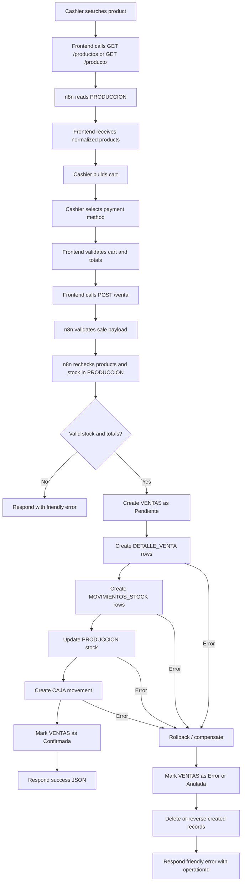

# Sale Flow

Sprint 1 design document and implementation reference.

This document defines the target architecture for a complete sale in CASERITAS OS.

Implementation status:

- `n8n-workflows/venta.json` implements the sale engine structure.
- `DETALLE_VENTA` and `MOVIMIENTOS_STOCK` must exist in Airtable before the workflow can run end to end.
- The workflow should be tested in n8n Cloud with real Airtable credentials before enabling production use.

## Goal

A sale must be reliable, auditable and recoverable.

The POS should send one sale request to n8n. n8n must validate the request, write all related records in Airtable, update stock through movement records, create the cash movement and return a normalized response to the frontend.

## Process Diagram



## Participating Tables

### Current

- `PRODUCCION`: product data and available stock.
- `VENTAS`: sale header.
- `CAJA`: financial movement generated by the sale.

### Required For Target Flow

- `DETALLE_VENTA`: one row per sold item.
- `MOVIMIENTOS_STOCK`: one row per stock decrease.

### Optional Later

- `CLIENTES`: if the sale is associated with a customer.
- `CAJA_DIA`: if cash opening/closing becomes formal.

## Endpoints

### Current Product Lookup

```txt
GET /productos?text=texto
GET /producto?code=7790000000000
```

### Target Sale Endpoint

```txt
POST /venta
```

The frontend should still send a single request. n8n owns the multi-step write process.

### Future Supporting Endpoints

```txt
GET /ventas/:id
GET /ventas/:id/detalle
POST /ventas/:id/anular
GET /stock/movimientos?ventaId=rec...
GET /caja?date=YYYY-MM-DD
```

## Request Payload

Target frontend request:

```json
{
  "operationId": "uuid-or-client-generated-id",
  "createdAt": "2026-07-24T12:00:00.000Z",
  "customerId": null,
  "items": [
    {
      "productId": "rec...",
      "name": "Producto",
      "barcode": "779...",
      "unitPrice": 100,
      "weight": 500,
      "quantity": 2,
      "lineTotal": 200
    }
  ],
  "paymentMethod": "cash",
  "cashReceived": 500,
  "subtotal": 200,
  "discountPercent": 0,
  "discountAmount": 0,
  "total": 200,
  "cashier": null,
  "source": "pos"
}
```

`operationId` is strongly recommended for idempotency and rollback traceability.

## API Response

### Success

```json
{
  "ok": true,
  "operationId": "uuid-or-client-generated-id",
  "saleId": "recVENTA",
  "detailIds": ["recDETALLE1", "recDETALLE2"],
  "stockMovementIds": ["recSTOCK1", "recSTOCK2"],
  "cashMovementId": "recCAJA",
  "status": "Confirmada",
  "message": "Venta registrada correctamente."
}
```

### Friendly Error

```json
{
  "ok": false,
  "operationId": "uuid-or-client-generated-id",
  "status": "Rechazada",
  "message": "No hay stock suficiente para uno o mas productos.",
  "details": [
    {
      "productId": "rec...",
      "available": 1,
      "requested": 2
    }
  ]
}
```

### Recovery Error

```json
{
  "ok": false,
  "operationId": "uuid-or-client-generated-id",
  "status": "Error",
  "message": "La venta no pudo completarse. Revisar operacion en n8n.",
  "saleId": "recVENTA",
  "rollbackStatus": "CompensacionPendiente"
}
```

## Validations

### Frontend Validations

Frontend validates quickly for cashier feedback:

- cart has at least one item;
- payment method is selected;
- cash received covers total when payment is cash;
- quantities are positive;
- totals are numeric.

Frontend validation improves UX but is not authoritative.

### n8n Validations

n8n must be authoritative:

- request body is valid JSON;
- `operationId` is present or generated;
- operation is not duplicated;
- items array is not empty;
- each item has product ID;
- each quantity is greater than zero;
- payment method is allowed;
- cash received is enough for cash payments;
- subtotal, discount and total match recalculated server-side values;
- each product exists in PRODUCCION;
- each product has `Stock Actual > 0`;
- requested quantity does not exceed available stock;
- sale total is greater than zero;
- optional customer exists if `customerId` is supplied.

## Possible Errors

### User/Business Errors

- empty cart;
- missing payment method;
- insufficient cash received;
- product no longer exists;
- product has no stock;
- requested quantity exceeds stock;
- total mismatch;
- duplicate operation ID.

### Technical Errors

- n8n execution limit reached;
- Airtable credential expired;
- Airtable rate limit;
- Airtable table/field renamed;
- network timeout;
- partial write failure;
- rollback failure.

## Atomic Transaction Requirements

Airtable does not provide true multi-table ACID transactions through n8n. Therefore the sale must be treated as a saga: every step must be traceable and reversible.

The business transaction is complete only when all of these succeed:

1. sale header exists in `VENTAS`;
2. all detail rows exist in `DETALLE_VENTA`;
3. all stock movement rows exist in `MOVIMIENTOS_STOCK`;
4. product stock is decreased in `PRODUCCION`;
5. cash movement exists in `CAJA`;
6. sale status is updated to `Confirmada`.

If any step fails before confirmation, n8n must compensate or mark the sale as failed.

## Definitive Table Schemas

### VENTAS

Purpose: sale header and transaction status.

Recommended fields:

```txt
VentaId
OperationId
Fecha
Cliente
MetodoPago
Subtotal
DescuentoPorcentaje
DescuentoImporte
Total
EfectivoRecibido
Vuelto
Estado
Cajero
Origen
CajaMovimiento
ErrorMensaje
FechaConfirmacion
FechaAnulacion
Notas
```

Recommended statuses:

```txt
Pendiente
Confirmada
Error
Anulada
RollbackPendiente
RollbackCompleto
```

Notes:

- `OperationId` should be unique.
- `Cliente` is optional in quick POS sales.
- `CajaMovimiento` links to CAJA after successful write.
- `ItemsJSON` can remain temporarily during migration but should not be the long-term reporting source.

### DETALLE_VENTA

Purpose: one row per sold product.

Recommended fields:

```txt
DetalleVentaId
Venta
OperationId
Producto
ProductoNombre
CodigoBarras
Cantidad
PrecioUnitario
Peso
SubtotalLinea
DescuentoLinea
TotalLinea
StockAntes
StockDespues
Estado
Fecha
```

Recommended statuses:

```txt
Pendiente
Confirmado
Anulado
RollbackCompleto
```

Notes:

- Store product name, barcode and unit price as historical snapshot.
- Link `Producto` to PRODUCCION when possible.

### MOVIMIENTOS_STOCK

Purpose: auditable inventory ledger.

Recommended fields:

```txt
MovimientoStockId
OperationId
Fecha
Producto
ProductoNombre
Tipo
Cantidad
StockAntes
StockDespues
Motivo
Origen
Venta
DetalleVenta
Responsable
Estado
Notas
```

Recommended movement types:

```txt
Venta
Produccion
Compra
Ajuste
Merma
Devolucion
Rollback
```

Recommended statuses:

```txt
Pendiente
Confirmado
Anulado
RollbackCompleto
```

Rules:

- sale movements must use negative quantity or `Tipo = Venta` with positive quantity and clear direction. Choose one convention and keep it globally.
- recommended convention: `Cantidad` is signed. Sale decreases stock, so `Cantidad = -quantity`.

### CAJA

Purpose: financial ledger for cash/payment movement.

Recommended fields:

```txt
CajaMovimientoId
OperationId
Fecha
Tipo
Concepto
MetodoPago
Importe
Venta
Estado
CajaDia
Responsable
Origen
Referencia
ErrorMensaje
Notas
```

Recommended types:

```txt
Ingreso
Egreso
Ajuste
Anulacion
Rollback
```

Recommended statuses:

```txt
Pendiente
Confirmado
Anulado
RollbackCompleto
```

## Correct Airtable Write Order

Recommended order:

1. Validate request and generate/read `operationId`.
2. Check if `operationId` already exists in VENTAS.
3. Read all products from PRODUCCION.
4. Recalculate totals and validate stock.
5. Create VENTAS with `Estado = Pendiente`.
6. Create DETALLE_VENTA rows with `Estado = Pendiente`.
7. Create MOVIMIENTOS_STOCK rows with `Estado = Pendiente`.
8. Update PRODUCCION stock for each product.
9. Update DETALLE_VENTA rows to `Confirmado`.
10. Update MOVIMIENTOS_STOCK rows to `Confirmado`.
11. Create CAJA movement with `Estado = Confirmado`.
12. Update VENTAS to `Confirmada`, linking CAJA where possible.
13. Return success JSON.

Why this order:

- no sale is marked confirmed before stock and cash are written;
- detail rows exist before stock movements, so stock movements can reference them;
- stock is changed only after all validation and record creation succeed;
- final VENTAS status is the source of truth for whether the sale completed.

## Rollback / Compensation Strategy

Because Airtable operations are not atomic across tables, n8n should implement compensation.

### Tracking

Each workflow execution keeps a local `createdRecords` object:

```json
{
  "saleId": "rec...",
  "detailIds": [],
  "stockMovementIds": [],
  "cashMovementId": null,
  "stockUpdates": [
    {
      "productId": "rec...",
      "stockBefore": 10,
      "stockAfter": 8
    }
  ]
}
```

### Compensation Rules

If failure happens before stock update:

- mark VENTAS as `Error`;
- mark created detail/movement rows as `Anulado` or delete them if no audit requirement exists.

If failure happens after stock update:

- restore PRODUCCION `Stock Actual` using stored `stockBefore`;
- create compensating MOVIMIENTOS_STOCK rows with `Tipo = Rollback`;
- mark original stock movements as `RollbackCompleto`;
- mark VENTAS as `Error` or `RollbackCompleto`.

If failure happens after CAJA write:

- create CAJA reversal row with `Tipo = Rollback` or `Anulacion`;
- mark original CAJA row as `Anulado` where possible;
- restore stock if needed;
- mark VENTAS as `RollbackCompleto`.

If rollback fails:

- mark VENTAS as `RollbackPendiente`;
- include `operationId` and failed step in error response;
- notify owner/admin through n8n.

### Recommended n8n Pattern

Use a saga-style workflow:

```txt
Validate
  -> Load products
  -> Create sale pending
  -> Create details
  -> Create stock movements
  -> Update stock
  -> Create cash movement
  -> Confirm sale
  -> Respond success

On error:
  -> Compensation workflow
  -> Mark operation status
  -> Respond friendly failure
```

For maintainability, the rollback can be implemented as a separate n8n workflow called by the main sale workflow with `operationId` and the write log.

## Idempotency

`operationId` prevents duplicate sales when:

- the cashier double-clicks;
- frontend retries after timeout;
- n8n responds slowly;
- browser/network disconnects after Airtable writes.

Behavior:

- if `operationId` exists as `Confirmada`, return existing sale success;
- if `operationId` exists as `Pendiente`, return "Operacion en proceso";
- if `operationId` exists as `Error` or `RollbackPendiente`, return recovery message and do not create a duplicate sale.

## Design Recommendations Before Implementation

1. Create `DETALLE_VENTA` before adding serious reports.
2. Create `MOVIMIENTOS_STOCK` before automating stock decreases.
3. Add `OperationId` to VENTAS, DETALLE_VENTA, MOVIMIENTOS_STOCK and CAJA.
4. Prefer `Estado = Pendiente` then `Confirmada` instead of writing final records immediately.
5. Keep frontend request simple; keep transaction complexity in n8n.
6. Document every Airtable field exactly before editing workflows.
